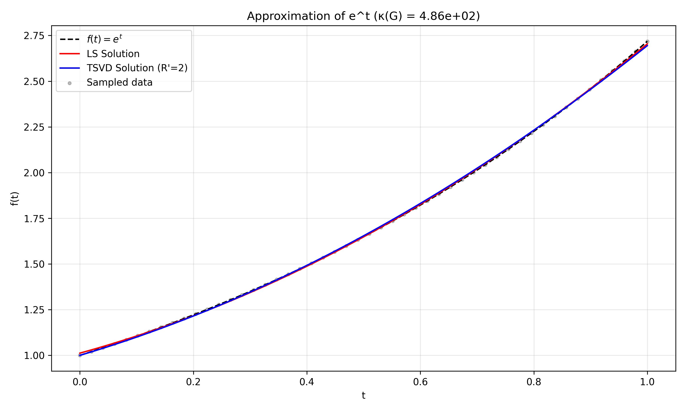
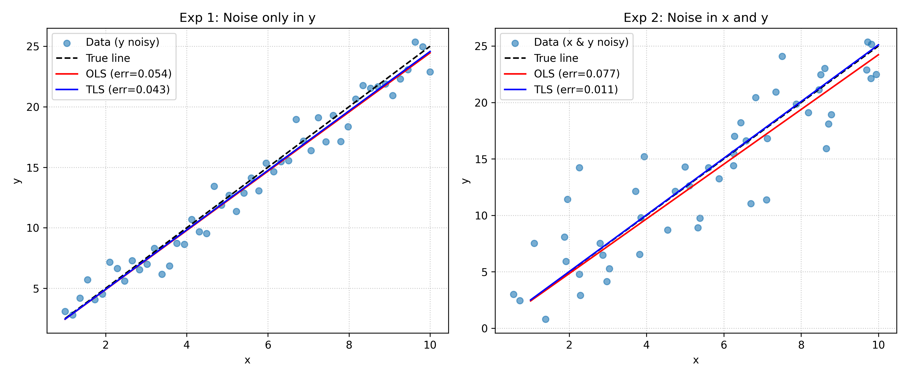
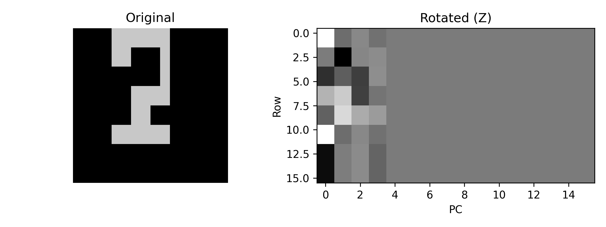
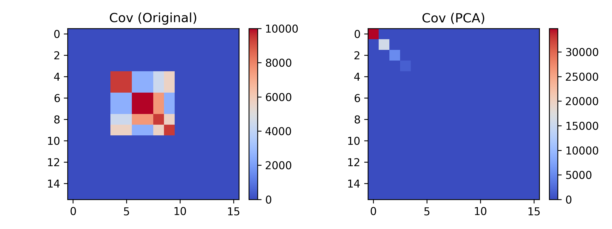
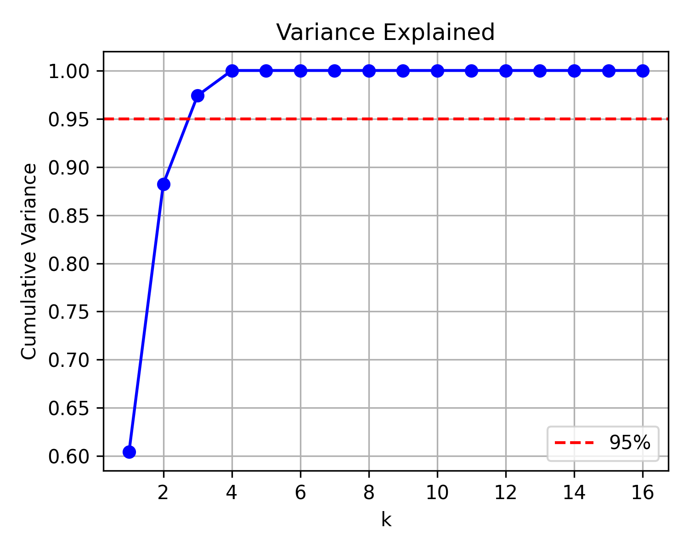
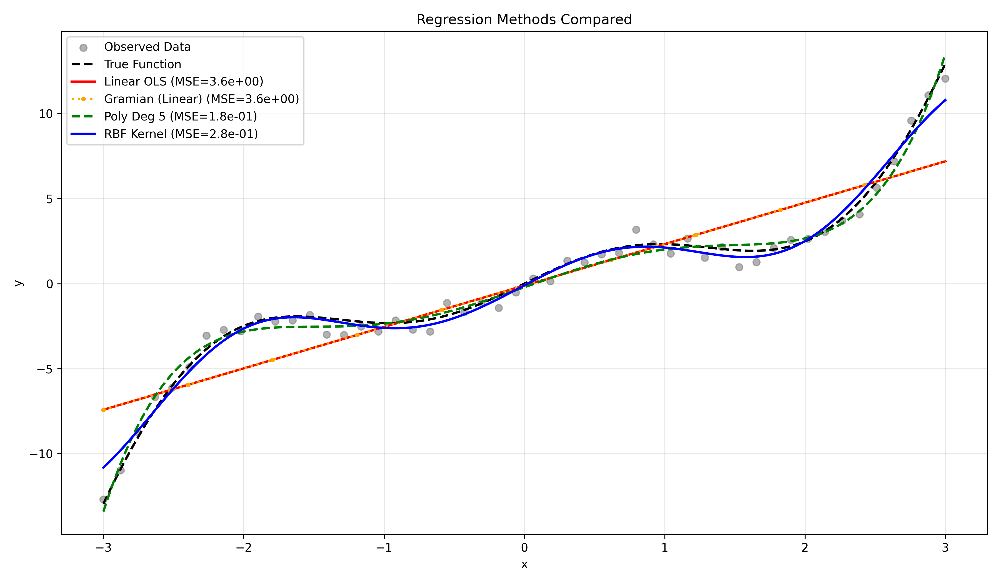

# Mathematics and Statistics for Data Analysis – Homework 4 (Computational Part)

Modular Python implementations and a companion Jupyter Notebook for the computational portion of the homework. Each script logs to console and `outputs/logs/homework4.log` while saving figures under `outputs/figures/`.

## Assignment Scope

- Q13: Gram matrices, ordinary LS, and truncated SVD to study conditioning and stability.
- Q14: Ordinary Least Squares vs. Total Least Squares under different noise models.
- Q15: PCA geometry, decorrelation, compression, and covariance heatmaps on a digit image.
- Q18: Regression with explicit polynomial features vs. kernel methods (linear Gramian and RBF).

## Methods and Features

- Linear/Polynomial regression via normal equations and least squares.
- Dual/Gram ridge formulation for linear features.
- RBF kernel ridge regression using the kernel trick.
- Truncated SVD for regularization; Tikhonov-style ridge where appropriate.
- PCA via both SVD and covariance eigendecomposition; reconstruction, energy curves, and heatmaps.
- Reusable utilities for kernels, logging, and plotting; consistent logging to file + console.

## Libraries

- Core: `numpy`, `scipy` (if present in requirements), `scikit-learn` (metrics and utilities).
- Visualization: `matplotlib`.
- Notebook support: `jupyter`, `ipykernel`.

## Directory Structure

```text
homework4/
├─ src/
│  ├─ logging_config.py
│  ├─ utils.py
│  ├─ monomial_ls_tsvd.py      # Q13
│  ├─ tls_experiments.py       # Q14
│  ├─ pca_analysis.py          # Q15
│  ├─ regression_kernels.py    # Q18
├─ notebooks/
│  └─ homework4_analysis.ipynb
├─ outputs/
│  ├─ logs/
│  │  └─ homework4.log
│  └─ figures/
│     ├─ monomial_ls_tsvd.png
│     ├─ tls_experiments.png
│     ├─ pca_steps.png
│     ├─ pca_covariance_heatmaps.png
│     ├─ pca_variance_curve.png
│     └─ regression_comparison.png
├─ README.md
├─ requirements.txt
└─ main.py (optional)
```

## Setup

Create and activate a virtual environment (recommended):

```bash
python -m venv .venv
source .venv/bin/activate  # Windows: .venv\\Scripts\\activate
```

Install requirements:

```bash
pip install -r requirements.txt
```

## Running the Code

Each question can be executed directly:

```bash
# Q13: Gram matrix, LS, and truncated SVD stability
python -m src.monomial_ls_tsvd

# Q14: OLS vs TLS under different noise models
python -m src.tls_experiments

# Q15: PCA geometry, decorrelation, and compression
python -m src.pca_analysis

# Q18: Explicit vs kernel regression
python -m src.regression_kernels
```

Outputs:
- Logs: `outputs/logs/homework4.log`
- Figures: `outputs/figures/*.png` (see previews below)

## Notebook

Launch the companion notebook:

```bash
jupyter notebook notebooks/homework4_analysis.ipynb
```

The notebook reuses the same functions from `src/`, walks through Q13, Q14, Q15, and Q18, and contains the Markdown answers for the theory portion.

## Figure Previews








## Figure Interpretations and Logged Metrics

- `monomial_ls_tsvd.png` (Q13): Shows LS vs TSVD fits of monomials on [0,1]. Gram condition number ≈ 4.86e2; LS residual 0.0396 vs TSVD residual 0.0540 with nearly identical coefficient norms (~1.56). TSVD drops the smallest singular direction to trade a small bias for stability.
- `tls_experiments.png` (Q14): Two noise models. When only y is noisy, OLS error ≈ 0.0545 and TLS ≈ 0.0433. When both x and y are noisy, TLS clearly wins (error ≈ 0.0105 vs OLS ≈ 0.0774), illustrating TLS advantage when inputs are corrupted.
- `pca_steps.png` and `pca_covariance_heatmaps.png` (Q15): PCA rotates the digit image to principal axes; off-diagonal covariance energy drops from ~3.07e4 to 0 after rotation, confirming decorrelation. First principal vector captures dominant stroke weights.
- `pca_variance_curve.png` (Q15): Reconstruction error vs retained components—k=1 error 603.1, k=3 error 154.7, and error collapses to ~0 by k=5. k=3 stores 67 numbers vs 256 (3.8x compression) with acceptable error.
- `regression_comparison.png` (Q18): MSE against true function: Linear OLS 3.64, Gramian-linear 3.64, Polynomial deg-5 1.82e-1 (best), RBF kernel 2.84e-1. Polynomial fit wins here, with RBF close behind; linear models underfit the nonlinear target.

All runs log to `outputs/logs/homework4.log` for reproducible metrics and timestamps.
